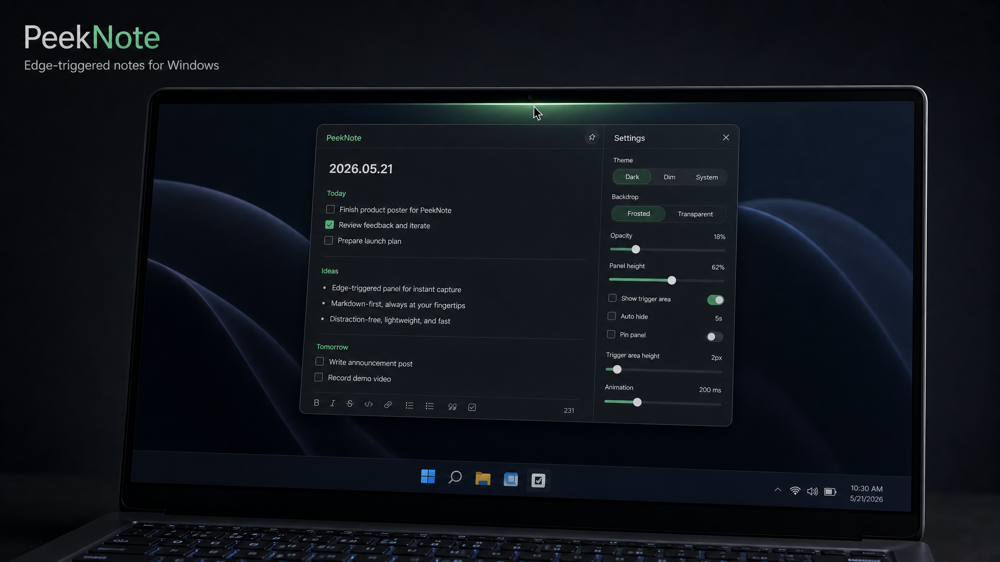

# PeekNote

PeekNote 是一个 Windows 边缘触发的悬浮笔记与待办面板。它平时隐藏在屏幕边缘，鼠标移到触发区域或按下快捷键后展开，适合快速记录待办、便签、Markdown 内容和临时想法。



## 功能特性

- 屏幕边缘触发：支持顶部、左侧、右侧触发。
- 悬浮面板：置顶显示，平时自动收起，不占用桌面空间。
- 圆角透明窗口：支持毛玻璃和实色两种界面质感。
- 深色、浅色、跟随系统主题。
- Markdown 编辑：支持标题、待办、列表、引用、代码、链接、分割线、图片等常见格式。
- 多标签笔记：支持新增、删除、重命名和拖拽排序。
- 粘贴图片：可直接在编辑区粘贴剪贴板图片。
- 面板尺寸调整：可拖拽边缘改变宽高，并同步到设置。
- 触发区域设置：支持调整触发宽度，并可临时显示触发范围。
- 固定面板：需要长期编辑时可以开启置顶固定。
- 全局快捷键：默认 `Ctrl + Alt + Space`。
- 托盘菜单：支持展开/收起、固定、打开数据目录和退出。
- 开机启动：安装版可在设置里开启。

## 安装

从 Release 或本地打包产物中运行安装包：

```text
release/PeekNote-0.1.0-setup.exe
```

安装完成后，移动鼠标到配置的屏幕边缘即可触发 PeekNote，也可以使用默认快捷键：

```text
Ctrl + Alt + Space
```

## 开发运行

需要本机安装：

- Node.js
- npm

安装依赖：

```powershell
npm install
```

开发模式启动：

```powershell
npm start
```

运行基础检查：

```powershell
npm run smoke
npm run self-test
```

## 打包

生成 Windows 安装包：

```powershell
npm run dist
```

安装包会输出到：

```text
release/
```

生成未打包目录，便于本地快速检查：

```powershell
npm run pack
```

## 数据存储

PeekNote 使用 Electron 的用户数据目录保存笔记和设置。开发模式和安装版的数据目录不同，托盘菜单中可以打开当前数据目录。

## 开机启动说明

安装版会直接注册安装后的 `PeekNote.exe`。开发模式下会注册 Electron 运行器并附带项目路径，仅用于本机调试。

普通用户使用安装包即可，不需要安装 Node.js、npm 或 Electron。

## 技术栈

- Electron
- HTML / CSS / JavaScript
- electron-builder

## 状态

当前版本仍是早期自用工具版本，功能以本地笔记和边缘触发展开为主。后续可以继续优化图标、安装器体验、更新机制和更轻量的 Tauri/原生实现。
